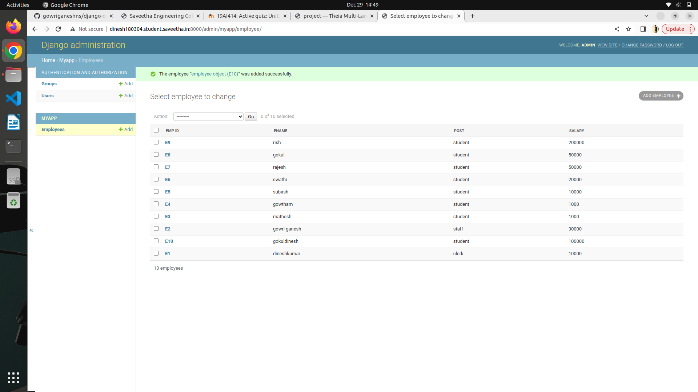
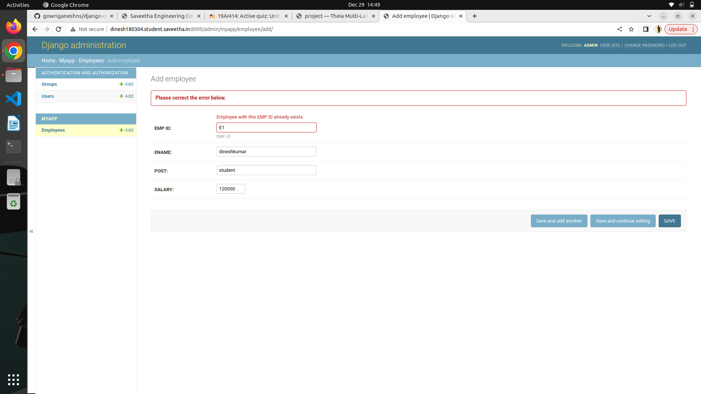

# Django ORM Web Application

## AIM
To develop a Django application to store and retrieve data from a database using Object Relational Mapping(ORM).

## Entity Relationship Diagram

Include your ER diagram here

## DESIGN STEPS

### STEP 1:
Then clone it. Create myapp

### STEP 2:
Then run the webserver,create the super user,after that create the 10 employee id
### STEP 3: 

Then add the screenshot of employee id in output

Write your own steps

## PROGRAM

#setting.py
DATABASES = {
    'default': {
        'ENGINE': 'django.db.backends.sqlite3',
        'NAME': BASE_DIR / 'db.sqlite3',
    }
}

#models.py

from django.db import models
from django.contrib import admin
# Create your models here.
class employee (models.Model):
    EMP_ID=models.CharField(primary_key=True,max_length=20,help_text="EMP_ID")
    ENAME=models.CharField(max_length=100)
    POST=models.CharField(max_length=20)
    SALARY=models.IntegerField()

class employeeAdmin(admin.ModelAdmin):
    list_display=('EMP_ID','ENAME','POST','SALARY')

admin.py
from django.contrib import admin
from .models import employee,employeeAdmin
# Register your models here.
admin.site.register(employee,employeeAdmin)

## OUTPUT

## Employee id

## primary key

## RESULT
Django application to store and retrieve data from a database using Object Relational Mapping(ORM) is developed